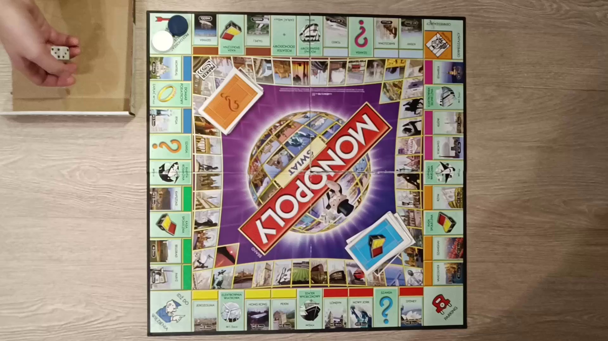
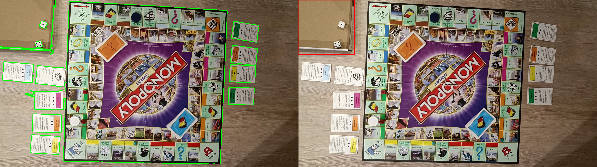

# CV Project - Game States Recognition

Bartosz Stachowiak 148259 <br>
Andrzej Kajdasz 148273
<hr>


## 1. Game Selection

For our project we decided to go with **Monopoly**


### Brief Description

Monopoly is a multi-player economics-themed board game. In the game, players roll two dice to move
around the game board, buying and trading properties and developing them with houses and hotels. Players collect rent from their opponents, aiming to drive them into bankruptcy.

### Relaxations:

Since Monopoly is a complex game we had to simplify some of its parts to make the project possible using classical Computer Vision. The relaxations are as follows:
- There are only two players.
- Money is not tracked and not present in the recordings.
- Default Monopoly pieces are replaced with Black and White bottle caps.
- Property cards have additional dots on them to provide distinguishibility between different cards from the same faimily.
- There is a dedicated area for throwing dice in which dice rolls are detected.

### Items we detect:
- pawns
- dices
- board
- property cards
- dice throwing area
- dots on property cards

### Events we detect:
- dice roll
- player changes position
- player acquires property card
- going to jail
- player takes a Chance card
- player takes a Community Chest card
- player passes through GO 
- player pays Income Tax
- player pays Super Tax

### Link to dataset:

https://drive.google.com/drive/folders/1HA0QrZlcn5DyrJS5MQkbRNPFyX1x3uxm?usp=share_link


### Sample pictures:

#### Easy set


#### Medium set




#### Hard set


```python
import json
import pathlib

import cv2
import numpy as np
import matplotlib.pyplot as plt

from statistics import mode

from src.video import VideoHandler
from src.feed import LiveFrameProcessor
from src.display import showarray
from src.processing import Homographer, ImageMatcher, BoardMapper
from src.processing import features, calc, detectors, analyzers
from src.monopoly.elements import FieldIndex, deserialize_families, deserialize_fields
```

## 2. Detecting Items

### Board

To detect the board we used SIFT matching between the template board photo and the image from recording.


```python
board_image = cv2.imread("data/images/board.jpg")
showarray(board_image)
```


    

    


```python
sample_image = cv2.imread("data/images/Medium_3_0.jpg")
showarray(sample_image)
```


    

    


```python
image_matcher = ImageMatcher(board_image, sample_image)
matches = image_matcher.get_matches()
showarray(ImageMatcher(board_image, sample_image).get_image_with_matches(matches[:100]))
```


    

    


```python
homographer = Homographer(image_matcher.kp_ref, image_matcher.kp_match, matches)
inv_homography, _ = homographer.get_inverse_homography()
warped_image = cv2.warpPerspective(sample_image, inv_homography, (board_image.shape[1], board_image.shape[0]))
showarray(warped_image)
```


    

    


```python
homography, _ = homographer.get_homography()
dst_rect = features.get_board_min_rect_from_homography(homography, board_image)
board_points = cv2.boxPoints(dst_rect)
board_points = np.int0(board_points)

showarray(cv2.polylines(sample_image.copy(), [board_points], True, (0, 255, 0), 3))
```


    

    


### Pawns

As previously mentioned we decided to use bottle caps as pawns - this is due to the fact that the irregularity of the default pieces was to hard to overcome and reliably detect.
This was not that big of a simplification since detecting even the caps was challanging and required lots of tries to get it to work reliably:
- Using just Canny detection with SimpleBlobDetector did not work great since the color of the caps would often blend in enough so that its edges would not be detected.
- Hough Circles gave very unstable results with lots of false positives

It turned out that the working solution would be to use dilated inverted and eroded Canny edges with a SimpleBlobDetector with specific params, then to filter the found keypoints by the placement on the board and finaly by the color of the found keypoint area.


```python
pawn_image = cv2.imread("data/images/Easy_2_0.jpg")
showarray(pawn_image)
```


    

    


```python
edges = cv2.Canny(pawn_image, 70, 250)
edges_dil = cv2.dilate(edges, np.ones((3, 3), np.uint8), iterations=1)
edges_inv = cv2.bitwise_not(edges_dil)
edges_err = cv2.erode(edges_inv, np.ones((3, 3), np.uint8), iterations=2)
showarray(np.concatenate((edges, edges_dil, edges_inv, edges_err), axis=1))
```


    

    


Very strong borders allowed us to reliably detect round objects. The added benefit of this method is that is is largely robust to lighting changes (since it operates on edge detection not on raw colors)


```python
black_detector = detectors.get_black_piece_detector()
white_detector = detectors.get_white_piece_detector()

black_pieces = black_detector.detect(edges_err)
white_pieces = white_detector.detect(edges_err)

pawn_image_copy = pawn_image.copy()
cv2.drawKeypoints(pawn_image_copy, black_pieces, pawn_image_copy, color=(0, 0, 255), flags=cv2.DRAW_MATCHES_FLAGS_DRAW_RICH_KEYPOINTS)
cv2.drawKeypoints(pawn_image_copy, white_pieces, pawn_image_copy, color=(255, 0, 0), flags=cv2.DRAW_MATCHES_FLAGS_DRAW_RICH_KEYPOINTS)
showarray(pawn_image_copy)
```


    

    


```python
# Calculate homography for pawn image
image_matcher = ImageMatcher(board_image, pawn_image)
matches = image_matcher.get_matches()
homographer = Homographer(image_matcher.kp_ref, image_matcher.kp_match, matches)
homography, _ = homographer.get_homography()
dst_rect = features.get_board_min_rect_from_homography(homography, board_image)
board_points = cv2.boxPoints(dst_rect)

# Filter pieces inside board
black_pieces_inside_board = [piece for piece in black_pieces if cv2.pointPolygonTest(board_points, (piece.pt[0], piece.pt[1]), False) >= 0]
white_pieces_inside_board = [piece for piece in white_pieces if cv2.pointPolygonTest(board_points, (piece.pt[0], piece.pt[1]), False) >= 0]

pawn_image_copy = pawn_image.copy()
cv2.drawKeypoints(pawn_image_copy, black_pieces_inside_board, pawn_image_copy, color=(0, 0, 255), flags=cv2.DRAW_MATCHES_FLAGS_DRAW_RICH_KEYPOINTS)
cv2.drawKeypoints(pawn_image_copy, white_pieces_inside_board, pawn_image_copy, color=(255, 0, 0), flags=cv2.DRAW_MATCHES_FLAGS_DRAW_RICH_KEYPOINTS)
showarray(pawn_image_copy)
```


    

    


```python
# Get inner board area
midpoint = calc.get_mid_point_from_rect_points(board_points)
scaled = np.int32((board_points - midpoint) * 0.66 + midpoint)

# Filter pieces inside fields area
black_pieces_inside_fields_area = [piece for piece in black_pieces_inside_board if cv2.pointPolygonTest(scaled, (piece.pt[0], piece.pt[1]), False) < 0]
white_pieces_inside_fields_area = [piece for piece in white_pieces_inside_board if cv2.pointPolygonTest(scaled, (piece.pt[0], piece.pt[1]), False) < 0]

pawn_image_copy = pawn_image.copy()
cv2.polylines(pawn_image_copy, [scaled], True, (0, 255, 0), 3)
cv2.polylines(pawn_image_copy, [np.int32(board_points)], True, (0, 255, 0), 3)
cv2.drawKeypoints(pawn_image_copy, black_pieces_inside_fields_area, pawn_image_copy, color=(0, 0, 255), flags=cv2.DRAW_MATCHES_FLAGS_DRAW_RICH_KEYPOINTS)
cv2.drawKeypoints(pawn_image_copy, white_pieces_inside_fields_area, pawn_image_copy, color=(255, 0, 0), flags=cv2.DRAW_MATCHES_FLAGS_DRAW_RICH_KEYPOINTS)
showarray(pawn_image_copy)
```


    

    


```python
black_with_color = [(kp, features.get_rect_around_point(kp.pt, pawn_image, 60, 60).mean()) for kp in black_pieces_inside_fields_area]
white_with_color = [(kp, features.get_rect_around_point(kp.pt, pawn_image, 60, 60).mean()) for kp in white_pieces_inside_fields_area]
black_with_color = [(kp, color) for kp, color in black_with_color if 20 < color < 70]
white_with_color = [(kp, color) for kp, color in white_with_color if color > 170]
black_with_color = sorted(black_with_color, key=lambda kp: kp[1])
white_with_color = sorted(white_with_color, key=lambda kp: kp[1], reverse=True)
black_pieces_final = list(zip(*black_with_color))[0]
white_pieces_final = list(zip(*white_with_color))[0]

pawn_image_copy = pawn_image.copy()
cv2.polylines(pawn_image_copy, [scaled], True, (0, 255, 0), 3)
cv2.polylines(pawn_image_copy, [np.int32(board_points)], True, (0, 255, 0), 3)
cv2.drawKeypoints(pawn_image_copy, black_pieces_final, pawn_image_copy, color=(0, 0, 255), flags=cv2.DRAW_MATCHES_FLAGS_DRAW_RICH_KEYPOINTS)
cv2.drawKeypoints(pawn_image_copy, white_pieces_final, pawn_image_copy, color=(255, 0, 0), flags=cv2.DRAW_MATCHES_FLAGS_DRAW_RICH_KEYPOINTS)
ORANGE = (0, 120, 255)
CYAN = (255, 255, 0)
cv2.drawMarker(pawn_image_copy, np.int32(white_pieces_final[0].pt), ORANGE, markerType=cv2.MARKER_CROSS, markerSize=20, thickness=3)
cv2.drawMarker(pawn_image_copy, np.int32(black_pieces_final[0].pt), CYAN, markerType=cv2.MARKER_CROSS, markerSize=20, thickness=3)
showarray(pawn_image_copy)
```


    

    


### Dice Throwing Area

Since we use dots to read dice results but also to distinguish property cards, we need to detect the area where dice are located. We use it by searching for an appropriate contour on adequatly binarized image.

In case several matching contours are found we choose the one with the smallest standard deviation (since the cardboard area is very cohesive in color)

For demonstration we will reuse the previous image.


```python
image_gs = cv2.cvtColor(pawn_image, cv2.COLOR_BGR2GRAY)
image_gs_blur = cv2.GaussianBlur(image_gs, (5, 5), 0)
edges = cv2.Canny(image_gs_blur, 70, 250)
edges_dil = cv2.dilate(edges, np.ones((3, 3), np.uint8), iterations=1)

showarray(np.concatenate((image_gs, image_gs_blur, edges, edges_dil), axis=1))
```


    

    


```python
contours, _ = cv2.findContours(edges_dil, cv2.RETR_EXTERNAL, cv2.CHAIN_APPROX_SIMPLE)
all_countoured_image = cv2.drawContours(pawn_image.copy(), contours, -1, (0, 255, 0), 3)

# Get bouding rects to simplify area calculation
contour_bounding_rects = [cv2.boundingRect(c) for c in contours]

# Filter by area
contour_bounding_rects = [
    r for r in contour_bounding_rects if 100000 < r[2] * r[3] < 200000
]

# Sort by standard deviation ascendingly
sorted_bounding_rects = sorted(
    contour_bounding_rects, key=lambda r: features.get_image_fragment_by_rect(pawn_image, r).std()
)

pawn_image_copy = pawn_image.copy()
best_rect = sorted_bounding_rects[0]
cv2.rectangle(pawn_image_copy, best_rect[:2], (best_rect[0] + best_rect[2], best_rect[1] + best_rect[3]), (0, 0, 255), 3)
for rect in sorted_bounding_rects[1:]:
    cv2.rectangle(pawn_image_copy, rect[:2], (rect[0] + rect[2], rect[1] + rect[3]), (0, 255, 0), 3)
showarray(np.concatenate([all_countoured_image, pawn_image_copy], axis=1))

```


    

    


### Dots

The dots turned out to be the simples ones to detect - we can use SimpleBlobDetector on raw image and it works very reliably.

We will once again reuse the previous image.


```python
detector = detectors.get_dots_detector()
dots = detector.detect(pawn_image)
dots_image = cv2.drawKeypoints(pawn_image.copy(), dots, pawn_image.copy(), color=(0, 0, 255), flags=cv2.DRAW_MATCHES_FLAGS_DRAW_RICH_KEYPOINTS)
showarray(dots_image)
```


    

    


We can use the dice throwing area rectangle to separate card dots from dice dots and the board area to filter out false positives


```python
# Filter out keypoints inside the board
filtered_dots = [d for d in dots if cv2.pointPolygonTest(board_points, d.pt, False) < 0]

# Separate on dice throwing area
dice_dots = [d for d in dots if calc.is_inside_bounding_rect(d.pt, best_rect)]
card_dots = [d for d in dots if not calc.is_inside_bounding_rect(d.pt, best_rect)]

GREEN = (0, 255, 0)
RED = (0, 0, 255)
dots_image = cv2.drawKeypoints(pawn_image.copy(), filtered_dots, pawn_image.copy(), color=RED, flags=cv2.DRAW_MATCHES_FLAGS_DRAW_RICH_KEYPOINTS)
dots_image = cv2.drawKeypoints(dots_image, dice_dots, dots_image, color=GREEN, flags=cv2.DRAW_MATCHES_FLAGS_DRAW_RICH_KEYPOINTS)
showarray(dots_image)
```


    

    


### Cards

The initial Cards detection method based of finding contours of right proportions on clear Canny edges turned out to be very fragile, hence we had to find out a more robust approach.

The one that worked the best was by finding contours on image found with adaptive threshold.

When filtering contours we used the fact that cards should have edges with proportion 8.5:5.5.


```python
img_gs = cv2.cvtColor(pawn_image, cv2.COLOR_BGR2GRAY)
img_gs_blur = cv2.GaussianBlur(img_gs, (5, 5), 0)
thresholded = cv2.adaptiveThreshold(
    img_gs_blur, 255, cv2.ADAPTIVE_THRESH_MEAN_C, cv2.THRESH_BINARY, 11, 2
)
thresholded_err = cv2.erode(thresholded, kernel=np.ones((3, 3), np.uint8), iterations=1)

showarray(np.concatenate((img_gs, img_gs_blur, thresholded, thresholded_err), axis=1))
```


    

    


```python
CARD_PROPORTION = 8.5 / 5.5

contours, _ = cv2.findContours(thresholded_err, cv2.RETR_EXTERNAL, cv2.CHAIN_APPROX_SIMPLE)
all_countoured_image = cv2.drawContours(pawn_image.copy(), contours, -1, (0, 255, 0), 3)
area_min = 10_000
area_max = 25_000
# Filter by area and edge proportion
filtered_contours = [cont for cont in contours if calc.is_min_area_in_bounds_and_good_edges_ratio(cont, area_min, area_max, CARD_PROPORTION)]
card_countoured_image = cv2.drawContours(pawn_image.copy(), filtered_contours, -1, (0, 255, 0), 3)

# Get bounding rects
card_bounding_rects = [cv2.boundingRect(c) for c in filtered_contours]

# Filter out rects inside the board
card_bounding_rects_outside_board = [r for r in card_bounding_rects if cv2.pointPolygonTest(board_points, (r[0] + r[2] / 2, r[1] + r[3] / 2), False) < 0]
pawn_image_copy = pawn_image.copy()
for rect in card_bounding_rects_outside_board:
    cv2.rectangle(pawn_image_copy, rect[:2], (rect[0] + rect[2], rect[1] + rect[3]), (0, 255, 0), 3)

showarray(np.concatenate([all_countoured_image, card_countoured_image, pawn_image_copy], axis=1))
```


    

    


## 3. Detecting Events

### Noise

No matter how robust our detectors are, the camera and hand movements as well as differences in lighting will produce noise and imperfections in our readings and we have to account for that when detecting events.

To see how noisy the readings are we will show the readings from each frame of the Easy_2.mp4 recording.

We denoised the data by simply taking the dominant of a specified number of past frames.


```python
readings = json.loads(pathlib.Path("data/meta/easy_2_analysis.json").read_text())
def denoise_series_left(series: list[int], window_size: int = 5) -> list[int]:
    return [mode(series[i - window_size:i]) for i in range(window_size, len(series) - window_size)]

readings["noisy"].keys()
```


    dict_keys(['black_cards', 'white_cards', 'black_pos', 'white_pos', 'dice_result', 'dice_pos_avg_x', 'dice_pos_avg_y', 'card_dots'])


```python
fig, ax = plt.subplots(1, 2, figsize=(15, 4))

ax[0].plot(readings["noisy"]["black_pos"], label="Black pawn position")
ax[0].plot(readings["noisy"]["white_pos"], label="White pawn position")
ax[0].set_ylabel("Field id")
ax[0].set_xlabel("Frame number")
ax[0].set_title("Noisy data")
ax[1].set_title("Denoised data")
ax[1].plot(denoise_series_left(readings["noisy"]["black_pos"], 130), label="Black pawn position")
ax[1].plot(denoise_series_left(readings["noisy"]["white_pos"], 130), label="White pawn position")
plt.suptitle("Detected positions over time")
plt.legend()
plt.show()
```


    

    


Note: for dice throws we do not want to denoise the data to much since we might loose the valuable information about the difference in throws.


```python
fig, ax = plt.subplots(1, 2, figsize=(15, 4))

ax[0].plot(readings["noisy"]["dice_result"], label="Black pawn position")
ax[0].set_ylabel("Throw result")
ax[0].set_xlabel("Frame number")
ax[0].set_title("Noisy data")
ax[1].set_title("Denoised data")
ax[1].plot(denoise_series_left(readings["noisy"]["dice_result"], 90), label="Black pawn position")
plt.suptitle("Detected dice throws over time")
plt.show()
```


    

    


```python
fig, ax = plt.subplots(1, 2, figsize=(15, 4))

ax[0].plot(readings["noisy"]["dice_pos_avg_x"], label="X")
ax[0].plot(readings["noisy"]["dice_pos_avg_y"], label="Y")
ax[0].set_ylabel("Pixel position")
ax[0].set_xlabel("Frame number")
ax[0].set_title("Noisy data")
ax[1].set_title("Denoised data")
ax[1].plot(denoise_series_left(readings["noisy"]["dice_pos_avg_x"], 130), label="X")
ax[1].plot(denoise_series_left(readings["noisy"]["dice_pos_avg_y"], 130), label="Y")
plt.suptitle("Detected average dice positions over time")
plt.legend()
plt.show()
```


    

    


For detecting cards we might want to use stronger denoising as they are often hidden behind hand movements


```python
fig, ax = plt.subplots(1, 2, figsize=(15, 4))

ax[0].plot(readings["noisy"]["black_cards"], label="Black cards")
ax[0].plot(readings["noisy"]["white_cards"], label="White cards")
ax[0].set_ylabel("Field id")
ax[0].set_xlabel("Number of cards")
ax[0].set_title("Noisy data")
ax[1].set_title("Denoised data")
ax[1].plot(denoise_series_left(readings["noisy"]["black_cards"], 250), label="Black cards")
ax[1].plot(denoise_series_left(readings["noisy"]["white_cards"], 250), label="White cards")
plt.suptitle("Detected card counts over time")
plt.legend()
plt.show()
```


    

    


### Field mapping

To detect position related events (movement, standing on special fields, etc.) we need to defined mapping between board pixels and fields.

The field and families metadata are present in respective json files in data/meta folder.


```python
serialized_families = json.loads(pathlib.Path("data/meta/families.json").read_text())
serialized_fields = json.loads(pathlib.Path("data/meta/fields.json").read_text())

families = {family.name: family for family in deserialize_families(serialized_families)}
fields = list(deserialize_fields(serialized_fields, families))
FIELD_INDEX = FieldIndex(fields)
```

We can use this index together with board homography to read which image pixels correspond to which fields. 


```python
board_mapper = BoardMapper(inv_homography, max(board_image.shape))
coords = black_pieces_final[0].pt
position = board_mapper.map_point_to_field_position(*coords)
field = FIELD_INDEX.get_by_place(*position)
print(field)

showarray(cv2.drawMarker(pawn_image.copy(), (int(coords[0]), int(coords[1])), (0, 255, 0), cv2.MARKER_CROSS, 20, 2))
```

    Field(id=4, name='Income Tax', family=Family(name='tax', house_price=-1, hotel_price=-1), placement='bottom', index=5, price=2, rent=[], current_level=0, mortgage=-1)
    


    

    


### Event detectors

Event detectors work by listening to the denoised output of context readers (which process raw detectors output)

They are defined as follows

#### Dice Event Detector

This detector listens to the average position of dice dots and their count.
In case it reads in 0 (denoting lack of detection), it waits for them to show up.
If their new position differs from the one before they were lost, the event is triggered (with some delay to stabilize detection).


#### Card Event Detector

Card events are assigned to a player, hence one detector has to be specified for each. It listens to the player position and player cards count.
If the cards count increases, it triggers the event of acquiring a new property. The name of the acquired property is inferred from the player's position.


#### Move Event Detector


As for Card events, Move events are assigned to a player. Move detector listens solely to the player position and based on the change of this position, triggers Move event of a player to a new position. However, move event detector is also responsible for trigerring:
- Player passed through GO event
- Player goes to prison event
- Player draws a community chest card event
- Player draws a chance card event
- Player pays income tax event
- Player pays super tax event

All of which are detected based on the players new position.

## 4. Results

### Easy Set

For a set of videos with an easy difficulty level, the program works very well.  The pawns are tracked correctly and only have to be found again after being obscured for a long time. 
The dice are also tracked in real time and the number of dots is counted correctly and then the throw information is displayed. The program correctly and without errors notices and informs about the purchase of a new property. 

Without problems, the program also detects standing on the special field and this aftermath that is taking the chance card or special cash or paying the tax. 

The program tracks the positions of the board and the dice throwing field without fail and is resistant to changing their positions. 
In the individual videos there are one-time errors due to various reasons.

In the first video (Easy_1), the program detects the card in the upper right corner even though it is not there, this is due to the fact that there is a combination of panels that has an aspect ratio exactly like the card. Once it miscounts the number of meshes because the cardboard covered one dot. 

In the third video (Easy_3), the program correctly counted the number of dots, but did not inform that a throw occurred. 

In addition to the above-mentioned individual cases, there is another common problem for all the videos. When a pawn is completely covered, e.g. by a hand, then it informs, e.g. that the pawn was moved to another field, which is sometimes random (the program tries to find the pawn at all costs). Another common small mistake is that when a hand with a pawn stops over a field for too long, the program informs that this is the final field for the pawn in this move, but when the move is completed the correct information about the position of the pawn is repeated.

**White piece position mistaken as other point**


### Medium Set

For a set of films with an intermediate level of difficulty, as for the easy set, most elements and events are tracked correctly. When the light changes slightly or when the shadow is small, the program still works flawlessly. 

However, the program does not cope with working in large shadows or in very low light. Then errors appear especially for the pawns which the program sees in the wrong places, which causes the program to constantly report changes in the position of these pawns. 

Despite this, the dots on cubes are still detected correctly. Cards are also correctly recognized however it takes more time due to poorer lighting. However, when the light returns to normal and the large shadows disappear the program reads the game state correctly again.

**Lost track of both pawns, bad count of black cards**


### Hard Set

For the set of videos with the most difficult difficulty level, the program does not work properly most of the time. 

The main reason is that the videos are made at too high an angle, which leads to the situation that the pawns and cubes are not detected correctly because their detection is based on the detection of circles (too high an angle causes distortion of the dots and especially of the pawns), not detecting the pawns and cubes most of the time causes a lack of information about the position of the pawns and the number of meshes. 

Despite these imperfections, the board is detected correctly and the shaking camera image does not cause any negative effects, which was already stated that the program is immune to changing camera positions.

**Program fails to detect most elements other than the board and the dice throwing area**


